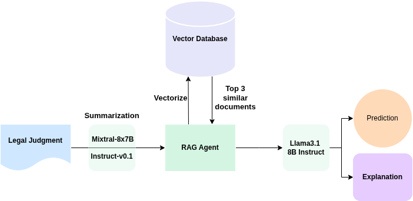

<h1 align="center">

<br>
NyayaRAG: Realistic Legal Judgment Prediction with RAG under the Indian Common Law System <br> (IJCNLP-AACL 2025)
</h1>


<p align="center">
  <a href="https://huggingface.co/L-NLProc"><b>[🌐 Website]</b></a> •
  <a href=""><b>[📜 Proceedings]</b></a> •
  <a href="https://arxiv.org/abs/2508.00709"><b>[📜 ArXiv]</b></a> •
  <a href=""><b>[🤗 HF Models]</b></a> •
  <a href="https://github.com/ShubhamKumarNigam/NyayaRAG"><b>[ GitHub]</b></a> •
  <a href=""><b>[📝 Dataset Access]</b></a> 
</p>

<p align="center">
  This is the official implementation of the paper:
</p>
<p align="center">
  <a href="">NyayaRAG: Realistic Legal Judgment Prediction with RAG under the Indian Common Law System</a>, to appear in <strong> <a href="https://2025.aaclnet.org/">IJCNLP-AACL 2025</a> </strong>
    
</p>
<p align="center">
 <b>Authors:</b> <a href="https://sites.google.com/view/shubhamkumarnigam">Shubham Kumar Nigam</a>, <a href="https://www.linkedin.com/in/balaramamahanthi-deepak-patnaik-b83043246/">Balaramamahanthi Deepak Patnaik</a>, <a href="https://www.linkedin.com/in/shivamm1602/">Shivam Mishra</a>, <a href="https://www.linkedin.com/in/ajaythomas-4231/">Ajay Thomas</a>, <a href="https://www.linkedin.com/in/noelshallum/">Noel Shallum</a>, <a href="https://sites.google.com/view/kripabandhughosh-homepage/home">Kripabandhu Ghosh</a>, and <a href="https://www.cse.iitk.ac.in/users/arnabb/">Arnab Bhattacharya</a>
</p>

## Overview

**NyayaRAG** is a Retrieval-Augmented Generation (RAG) framework designed for **legal judgment prediction and explanation** in the Indian common law system. It integrates **factual case descriptions**, **statutory provisions**, and **semantically retrieved prior cases** to emulate real-world courtroom reasoning.

This advancement sets a new benchmark for legal judgment prediction in the NLP community, making strides in both accuracy and explainability for legal applications.
If you have any questions on this work, please open a [GitHub issue](https://github.com/ShubhamKumarNigam/NyayaRAG/issues) or email the authors at

```shubhamkumarnigam@gmail.com, bdeepakpatnaik2002@gmail.com, shivam1602m@gmail.com```

---

## ⚖️ Motivation

India's legal system is overburdened with millions of pending cases. Most existing Legal Judgment Prediction (LJP) systems rely solely on case text, ignoring crucial legal reasoning based on **statutes and judicial precedents** — a fundamental part of Indian jurisprudence. **NyayaRAG** bridges this gap by grounding predictions in external legal knowledge.

---

## 🧱 Key Features

- **Realistic Legal Inputs:** Models receive not just factual case summaries but also applicable laws and top-k similar past cases.
- **Retrieval-Augmented Generation (RAG):** Prevents hallucination and ensures factual legal grounding.
- **Explanation Generation:** Predicts binary verdicts (accept/reject) along with coherent legal justifications.
- **Evaluation with G-Eval (LLM-as-a-Judge):** Beyond lexical metrics, we use GPT-4-based evaluation for legal soundness.

---

## 📊 Dataset

- **Source:** 56,387 Supreme Court of India judgments (from [IndianKanoon](https://indiankanoon.org))
- **Summarized using:** Mixtral-8x7B-Instruct
- **Components:**
  - Factual narratives
  - Statutory references (e.g., IPC, Constitution)
  - Explicitly cited precedents
  - Semantically similar prior cases via ChromaDB
- **Vector Embeddings:** `all-MiniLM-L6-v2`
- **Retrieval:** Top-3 most similar cases per input

---

## 🔧 Methodology


1. Summarization: Long judgments are shortened using a tailored prompt to extract key elements. <br>

2. Retrieval Pipelines: We construct multiple input pipelines:<br>
    - `Facts Only` <br>
    - `CaseText Only` <br>
    - `CaseText + Statutes`<br>
    - `CaseText + Precedents`<br>
    - `CaseText + Previous Similar Cases`<br>
    - `CaseText + Statutes + Precedents`<br>
    - `Facts + Statutes + Precedents`<br>
    
3. Prediction & Explanation:<br>
   - Binary Decision: 0 (Rejected) / 1 (Accepted) <br>
   - Legal Explanation: Natural language output referencing laws and precedents <br>
   
4. Model: LLaMA 3–8B Instruct with few-shot prompting<br>

---

## 📈 Evaluation

### 🔹 Judgment Prediction
- Metrics: Accuracy, Precision, Recall, F1-Score
- Best performance: `CaseText + Statutes` pipeline

### 🔹 Explanation Generation
- Metrics: ROUGE, BLEU, METEOR, BERTScore, BLANC
- G-Eval (LLM-based): Legal soundness, factuality, and clarity
- Highest G-Eval Score: `CaseText + Statutes` (4.21/10)

---

## 📌 Key Results

| Pipeline                           | Accuracy (%) | G-Eval Score |
|------------------------------------|--------------|--------------|
| CaseText Only                      | 62.27        | 4.17         |
| CaseText + Statutes               | <b>67.07</b>    | <b>4.21</b>     |
| CaseText + Statutes + Precedents  | 64.71        | 4.11         |
| Facts Only                         | 51.13        | 3.53         |

---
## 🔍 Future Work

NyayaRAG opens several promising avenues for future enhancements:

- **Multi-class or Hierarchical Verdicts:** Extend beyond binary outcomes to better reflect the complexity of real-world legal decisions.
- **Symbolic and Graph-based Legal Reasoning:** Combine dense retrieval with structured knowledge from legal ontologies and statute graphs.
- **Temporal Precedent Modeling:** Incorporate the time dimension to differentiate between outdated and recent precedents.
- **Human-in-the-loop Validation:** Enable feedback from legal professionals to improve reliability and trust.
- **Cross-jurisdictional Adaptation:** Explore adaptation of the framework to other common law systems beyond India.

---

## 📜 Disclaimer & Ethical Considerations

- The legal documents used were sourced from [IndianKanoon](https://indiankanoon.org), a public legal repository.
- This system is meant **strictly for research and academic purposes** and **not for real-world deployment**.
- No private or sensitive data has been used. All processing was performed on public data.
- Outputs from this model **do not constitute legal advice** and must not be used for legal decision-making without expert oversight.
- Although the system attempts to replicate human-like legal reasoning, it may still reflect biases present in source judgments or training data.

## Citation
If you use this project in your research or other work, please cite it as follows:
```
@misc{nigam2025nyayaragrealisticlegaljudgment,
      title={NyayaRAG: Realistic Legal Judgment Prediction with RAG under the Indian Common Law System}, 
      author={Shubham Kumar Nigam and Balaramamahanthi Deepak Patnaik and Shivam Mishra and Ajay Varghese Thomas and Noel Shallum and Kripabandhu Ghosh and Arnab Bhattacharya},
      year={2025},
      eprint={2508.00709},
      archivePrefix={arXiv},
      primaryClass={cs.CL},
      url={https://arxiv.org/abs/2508.00709}, 
}
